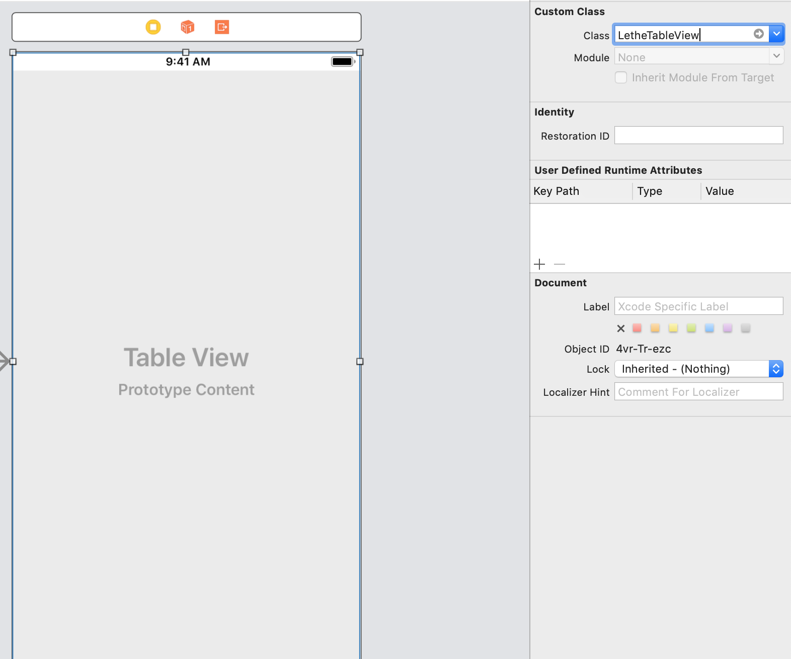

# LetheTableView

[](https://travis-ci.org/yildirimosman@outlook.com/LetheTableView)
[](https://cocoapods.org/pods/LetheTableView)
[](https://cocoapods.org/pods/LetheTableView)
[](https://cocoapods.org/pods/LetheTableView)

## Example

To run the example project, clone the repo, and run `pod install` from the Example directory first.

## Requirements

Installation
------------

### CocoaPods

LetheTableView is available through [CocoaPods](https://cocoapods.org). To install
it, simply add the following line to your Podfile:

```ruby
pod 'LetheTableView'
```

In any file you'd like to use LetheStretchyHeader in, don't forget to
import the framework with `import LetheTableView`.

### Manually
Download and drop `LetheTableView.swift, LetheHeaderView.swift, LetheTableViewProtocol.swift,` in your project.

Usage
------------



## License

LetheTableView is available under the MIT license. See the ``LICENSE` file for more info.
