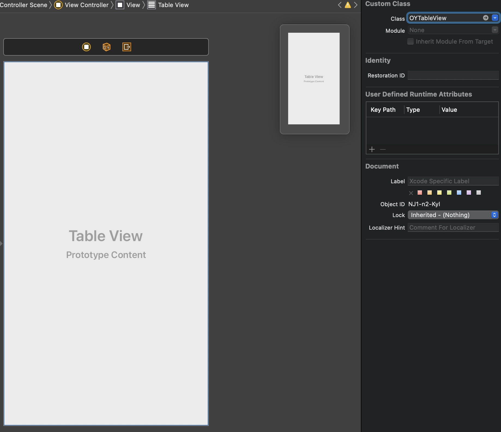

# OYTableView

[](https://travis-ci.org/yildirimosman@outlook.com/OYTableView)
[](https://cocoapods.org/pods/OYTableView)
[](https://cocoapods.org/pods/OYTableView)
[](https://cocoapods.org/pods/OYTableView)

## Example

To run the example project, clone the repo, and run `pod install` from the Example directory first.

## Requirements

Installation
------------

### CocoaPods

OYTableView is available through [CocoaPods](https://cocoapods.org). To install
it, simply add the following line to your Podfile:

```ruby
pod 'OYTableView'
```

In any file you'd like to use OYTableView in, don't forget to
import the framework with `import OYTableView`.

### Manually
Download and drop `OYTableView.swift, OYHeaderView.swift, OYTableViewProtocol.swift,` in your project.

Usage
------------



 ```swift
extension ViewController: OYTableViewDataSource, OYTableViewDelegate {
    func numberOfSections(in oyTableView: UITableView) -> Int {
        return 1
    }

    func oyTableView(_ tableView: UITableView, numberOfRowsInSection section: Int) -> Int {
        return headers.count
    }

    func oyTableView(_ tableView: UITableView, heightForHeaderInSection section: Int) -> CGFloat {
        return 40
    }

    func oyTableView(_ tableView: UITableView, heightForRowAt indexPath: IndexPath) -> CGFloat {
        return UITableView.automaticDimension
    }

    func oyTableView(_ tableView: UITableView, viewForHeaderInSection section: Int) -> UIView? {
        let headerView = TableHeader(frame: CGRect(x: 0, y: 0, width: UIScreen.main.bounds.width, height: 40))
        headerView.configure(headers[section])
        return headerView
    }

    func oyTableView(_ tableView: UITableView, cellForRowAt indexPath: IndexPath) -> UITableViewCell {
        let cell = tableView.dequeueReusableCell(withIdentifier: "TableCell", for: indexPath) as? TableCell
        cell?.configure(UIImage(named: String(indexPath.row))!)
        return cell ?? UITableViewCell()
    }

    func oyTableView(_ tableView: UITableView, didSelectRowAt indexPath: IndexPath) {

    }

    func oyTableView(_ tableView: UITableView, section: Int, didExpand header: OYHeaderView) {

    }

    func oyTableView(_ tableView: UITableView, section: Int?, didCollapse header: OYHeaderView) {

    }
}
```


## License

OYTableView is available under the MIT license. See the ``LICENSE` file for more info.
